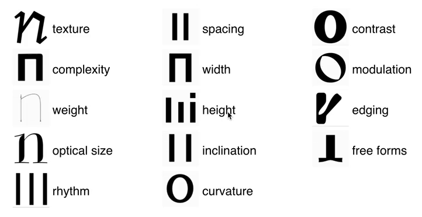
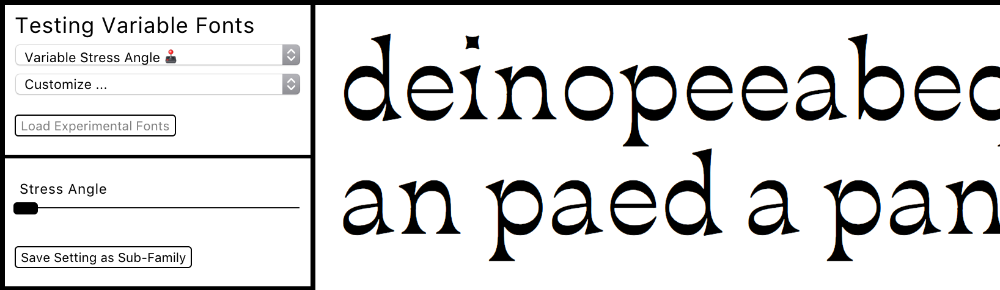

# Variable Fonts - Repository Overview   
Listing various repositories all more or less connected to variable fonts. (experiments, theory, tools, scripts, ...)  

## Typedesign Framework ([website](http://vongebhardi.de/theory/typedesign-framework/))
- Listing and sorting as many formal variables as possible.
- [github.com/../TypedesignFramework](https://github.com/Manuel87/TypedesignFramework)
  
---

## Experimental Variable Fonts ([external demo](http:vongebhardi.de/variable-fonts/testing/))
- Overview: [github.com/../VariableTypefaces](https://github.com/Manuel87/VariableTypefaces)
- [github.com/../RobotoFlex](https://github.com/Manuel87/RobotoFlex/)
- [github.com/../CrimVarious](https://github.com/Manuel87/CrimVarious/)

---

## Various
- https://github.com/Manuel87/ExperimentalParametricTypeface
- https://github.com/Manuel87/TypeMultiverse
- https://github.com/Manuel87/GlyphsApp-Multipolation

---

## Impressions

