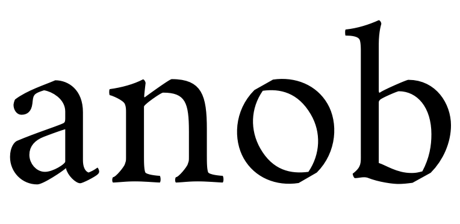
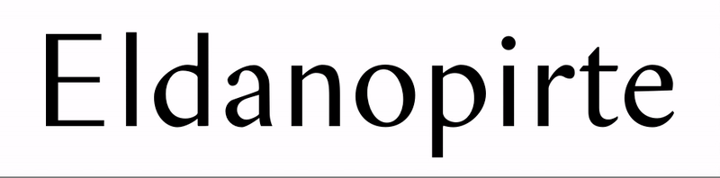
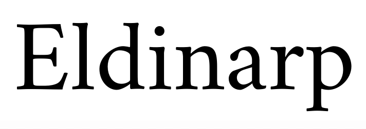
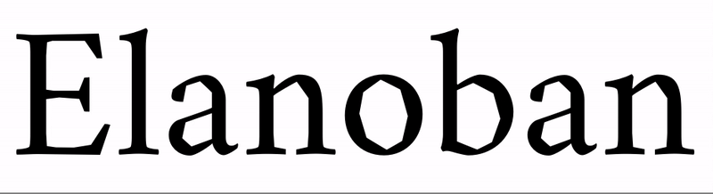
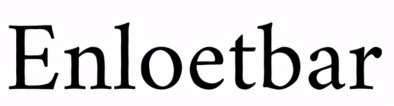
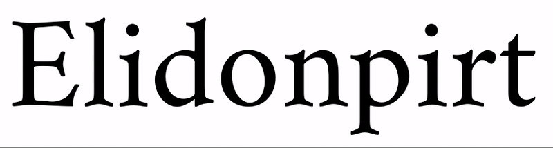

# CrimsonVarious

## Pen Models (Oldstyle——Modern)

char-set: a, n, o, b

## Serif Length (Sans——Serif)

char-set: E, l, d, n, o, p, i, r, t, e

## Serif Spur Angle

char-set: E, l, d, i, n, a, r, p

## Curvature > Broken

char-set: E, l, a, n, o, b

## Curvature > Wiggle

char-set: E, n, l, o, e, t, b, a, r

## Curvature > Serif (Concave——Convex)

char-set: E, l, o, d, i, n, p, r, t

## Flex
char-set: H,n,o

